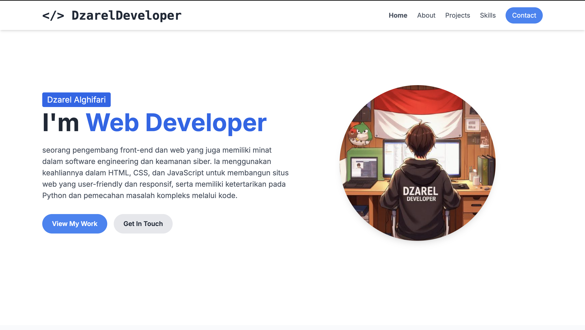

# DzarelDeveloper Portfolio



## 📌 Tentang Project
Portfolio website pribadi ini dibangun untuk menampilkan profil, karya (proyek), daftar keterampilan, dan informasi kontak dari **DzarelDeveloper** (Muhammad Dzarel Alghifari). Website ini dirancang dengan antarmuka yang modern, bersih, dan sangat responsif untuk berbagai ukuran layar perangkat, mulai dari smartphone hingga desktop.

Website ini berfokus pada performa dan kemudahan akses, memberikan gambaran jelas mengenai minat DzarelDeveloper di bidang *Web Development*, *Cybersecurity*, dan *Software Engineering*.

## ✨ Fitur Utama
- **Tampilan Responsif & Modern:** Desain antarmuka yang menyesuaikan dengan lancar di layar seluler, tablet, maupun desktop menggunakan Tailwind CSS.
- **Navigasi Smooth Scrolling:** Memberikan pengalaman transisi yang halus ketika berpindah antar bagian halaman.
- **Mobile-Friendly Menu:** Dilengkapi dengan tombol hamburger menu (hamburger menu) interaktif khusus untuk perangkat mobile.
- **Bagian Portfolio Proyek:** Menampilkan proyek-proyek terbaru lengkap dengan gambar, deskripsi singkat, dan tautan langsung ke repositori atau live demo.
- **Daftar Keterampilan (Skills):** Visualisasi ikonik daftar keterampilan teknis bahasa pemrograman dan *tools* yang dikuasai.
- **Form Kontak Fungsional:** Form yang terhubung langsung ke klien email default pengguna.

## 🗂 Struktur Halaman
Website ini merupakan *single-page application* (SPA) statis yang terdiri dari beberapa bagian utama:
1. **Home / Hero Section:** Perkenalan singkat dan fokus keahlian utama.
2. **About Me:** Penjelasan lebih detail mengenai latar belakang, ketertarikan pada dasar-dasar *backend*, praktik *secure coding*, dan visi ke depan.
3. **Projects:** Menampilkan proyek unggulan seperti:
   - *Hospot Login Page* (Custom halaman login Mikrotik)
   - *Active Programmer Mode* (Ekstensi Chrome untuk produktivitas)
   - *Website Kelas v3* (Website kelas interaktif dan modern)
4. **Skills:** Menampilkan rentang keahlian teknis yang mencakup HTML, CSS, JavaScript, Tailwind CSS, Python, Bash, Linux, dan C++.
5. **Contact:** Formulir untuk pengiriman pesan secara langsung (via `mailto:`).

## 🛠 Teknologi yang Digunakan
Proyek ini dibangun menggunakan teknologi dasar web dan *utility-first CSS framework* tanpa memerlukan proses *build script* yang rumit:
- **HTML5:** Struktur semantik dasar website.
- **CSS3:** Styling dasar.
- **JavaScript (Vanilla):** Menangani interaktivitas seperti *toggle* menu mobile dan fungsi navigasi.
- **Tailwind CSS (via CDN):** Framework CSS modern untuk styling yang cepat dan responsif secara langsung di dalam file HTML.
- **Google Fonts (Inter):** Tipografi yang bersih dan proporsional untuk kemudahan membaca.

## 🚀 Cara Menjalankan (Instalasi)
Karena proyek ini bersifat statis dan langsung menggunakan Tailwind CDN, Anda tidak perlu menginstal Node.js atau dependensi apa pun.

1. **Clone repository ini:**
   ```bash
   git clone https://github.com/Codesphered01010/Simple-Portofolio.git
   ```
2. **Masuk ke folder project:**
   ```bash
   cd Simple-Portfolio
   ```
3. **Jalankan aplikasi:**
   - Cukup buka file `index.html` di dalam browser favorit Anda (bisa dengan klik ganda atau *drag-and-drop*).
   - *Opsional:* Jika Anda menggunakan VS Code, Anda bisa menginstal ekstensi **Live Server** dan mengklik "Go Live" untuk membuka *local server* dengan fitur *auto-reload*.

## 🔗 Demo
Anda dapat melihat versi *live demo* dari portfolio ini secara langsung di [Sini](https://codesphered01010.github.io/Simple-Portofolio/)

## 📄 Lisensi
Project ini menggunakan lisensi [MIT](LICENSE). Boleh dimodifikasi dan didistribusikan secara bebas, namun harap untuk tetap menyertakan kredit kepada pembuat asli.

## 👏 Kredit & Atribusi
- **Desain & Pengembangan:** [DzarelDeveloper](https://github.com/DzarelDeveloper)
- **Ikon Keterampilan (Skills):** [Devicon](https://devicon.dev/)
- **Ikon UI Tambahan:** [SVG Repo](https://www.svgrepo.com/)
- **Foto & Media Tambahan:** Berbagai sumber (GitHub Avatars, dll).
